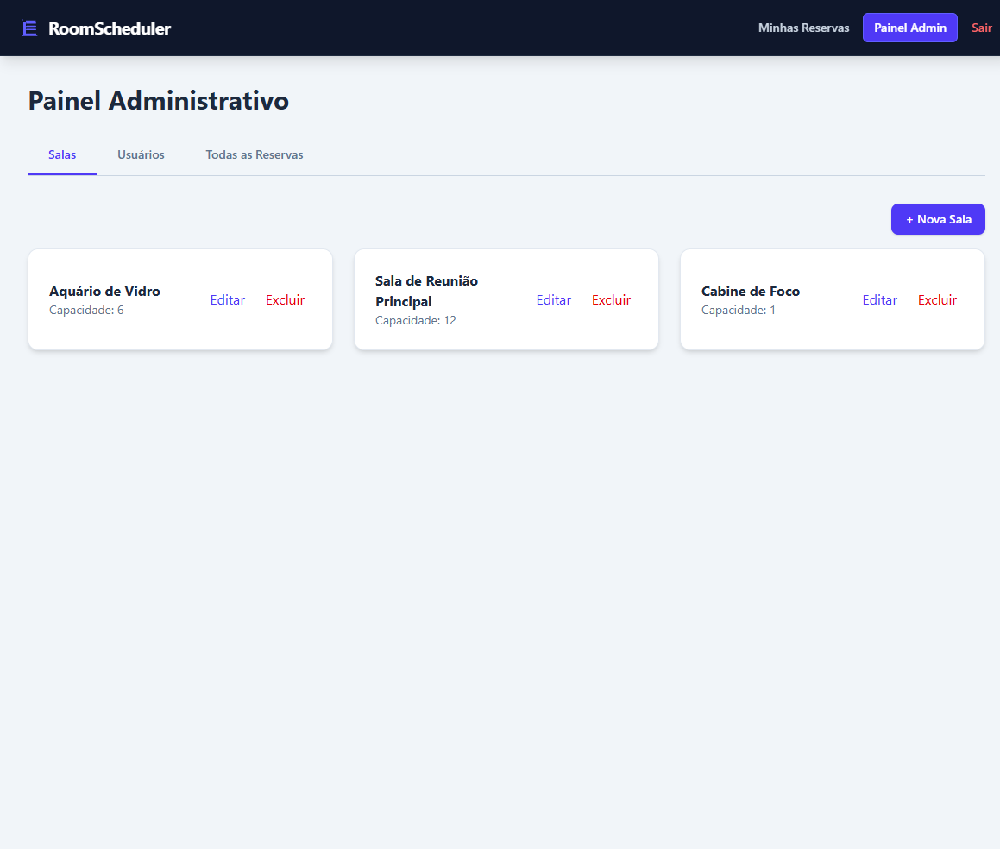
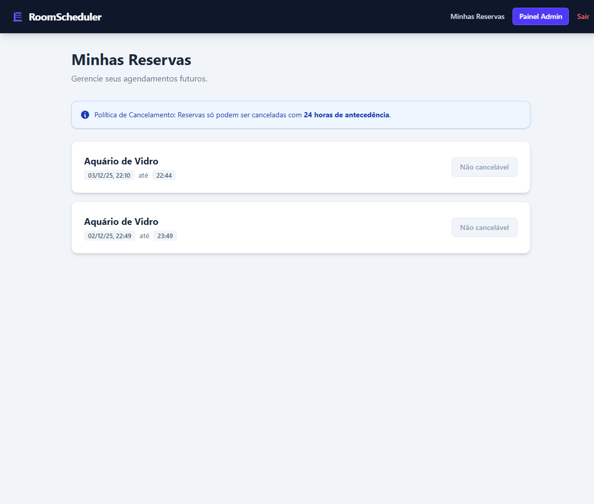
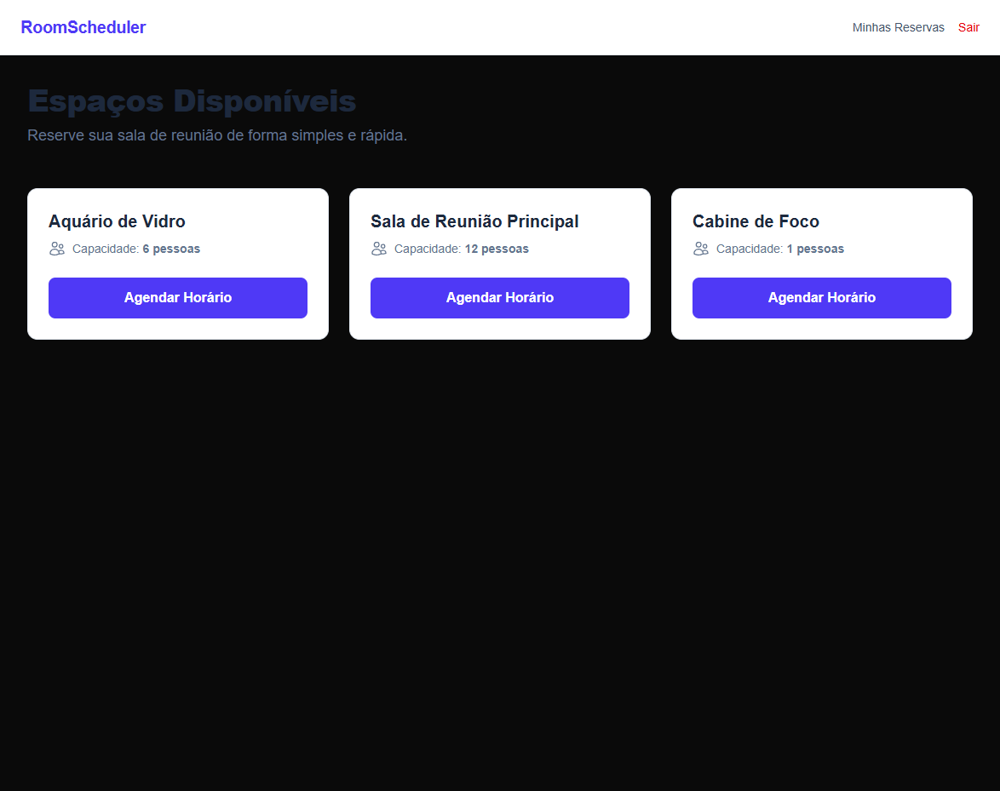

# RoomScheduler 🏢

> Sistema corporativo Full Stack de gestão de espaços e agendamentos com controle de concorrência e segurança RBAC.


[Read this document in English](README.md)

## 📖 Sobre o Projeto

O **RoomScheduler** é uma solução completa para resolver o problema de conflitos em reservas de salas de reunião. Diferente de um CRUD simples, este sistema implementa uma **lógica de agendamento stateful**, garantindo matematicamente que duas pessoas nunca ocupem o mesmo espaço no mesmo horário (Double Booking Prevention).

O projeto foi arquitetado simulando um ambiente de produção real, utilizando **Deploy Híbrido** em três nuvens diferentes para otimizar custos, performance e segurança.

### 🌐 Links de Produção

-   **Aplicação (Frontend):** [Acessar RoomScheduler (Vercel)](https://room-scheduler-gold.vercel.app/)
-   **API (Backend):** [Status da API (Render)](https://room-scheduler-api.onrender.com/api/rooms)

---

## 🏗️ Arquitetura e Tecnologias

O sistema segue uma arquitetura distribuída e "Cloud Native":

### Backend (API RESTful)

-   **Java 21 & Spring Boot 3:** Core da aplicação robusto e tipado.
-   **Spring Security + JWT:** Autenticação Stateless e controle de permissão (RBAC - Role Based Access Control).
-   **Hibernate/JPA:** Camada de persistência otimizada.
-   **Docker:** Containerização com Multi-stage build (Maven image -> JRE Alpine image) para deploy leve.
-   **Hospedagem:** Render.

### Frontend (SPA/SSR)

-   **Next.js 15 (App Router):** Framework React moderno com Server Components.
-   **TypeScript:** Tipagem estrita compartilhada com o Backend via interfaces.
-   **Tailwind CSS:** Estilização responsiva com tema corporativo "Clean".
-   **Middleware:** Proteção de rotas e gestão segura de Cookies.
-   **Hospedagem:** Vercel (Edge Network).

### Dados

-   **PostgreSQL (Neon Tech):** Banco de dados Serverless na nuvem para alta disponibilidade.

---

## ✨ Funcionalidades Principais

### 🔒 Segurança & Identidade

-   **Autenticação JWT:** Login seguro com token assinado e Cookies HttpOnly.
-   **RBAC (Roles):** Diferenciação estrita entre `USER` (comum) e `ADMIN` (gestor).
-   **Proteção de Rotas:** Middleware no Frontend impede acesso não autorizado a páginas administrativas.

### 📅 Gestão de Reservas Inteligente

-   **Algoritmo de Conflito:** Impede reservas sobrepostas no banco de dados (`StartA < EndB && EndA > StartB`).
-   **Regras de Negócio (SLA):** Cancelamento permitido apenas com 24h de antecedência para usuários comuns.
-   **Super Admin:** Administradores possuem override para cancelar qualquer reserva a qualquer momento.

### ⚙️ Painel Administrativo Completo

-   **Gestão de Salas:** Criar, Editar e Excluir espaços físicos.
-   **Gestão de Usuários:** Listar usuários, promover para Admin ou banir do sistema.
-   **Auditoria:** Visualização global de todos os agendamentos.

---

## 📸 Screenshots

### Dashboard Administrativo


_Visão geral das reservas e gestão de salas/usuários._

### Minhas Reservas (Regra de 24h)


_Interface do usuário mostrando bloqueio de cancelamento para prazos curtos._

### Landing Page


_Listagem pública de salas disponíveis._

---

## 🚀 Como Rodar Localmente

Siga estes passos para executar o projeto na sua máquina:

### Pré-requisitos

-   Docker & Docker Compose
-   Java 21 (JDK)
-   Node.js 18+

### Passo 1: Clonar e Configurar

```bash
git clone [https://github.com/paulorag/room-scheduler.git](https://github.com/paulorag/room-scheduler.git)
cd room-scheduler
```

### Passo 2: Banco de Dados (Docker)

Suba o container do Postgres localmente:

```bash
docker-compose up -d
```

### Passo 3: Backend (Spring Boot)

Em um terminal separado:

```bash
cd scheduler
./mvnw spring-boot:run
```

_O Backend rodará em http://localhost:8080_

### Passo 4: Frontend (Next.js)

Em outro terminal:

```bash
cd frontend
npm install
npm run dev
```

_O Frontend rodará em http://localhost:3000_

Desenvolvido por Paulo Roberto A. Gomes.
